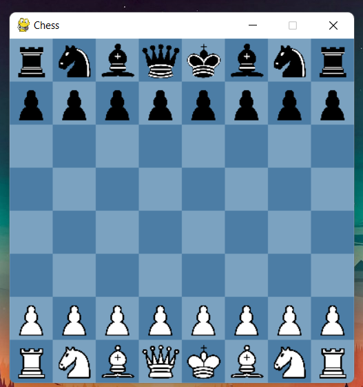
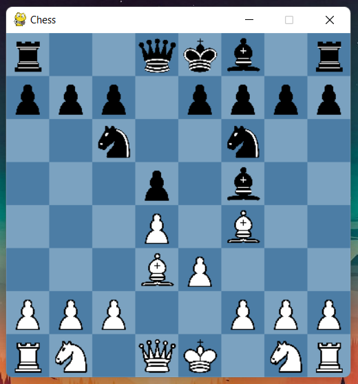

# chesspy - Chess written in Python

Chesspy is chess written in python.

Requirements:
  * [Pygame](https://www.pygame.org/wiki/GettingStarted) - Graphics Module

References:
  * Articles and resources from [The Chess Programming Wiki](https://www.chessprogramming.org/Main_Page)
  * Resources from [Chess.com](https://www.chess.com/) games and theory articles

## Images

